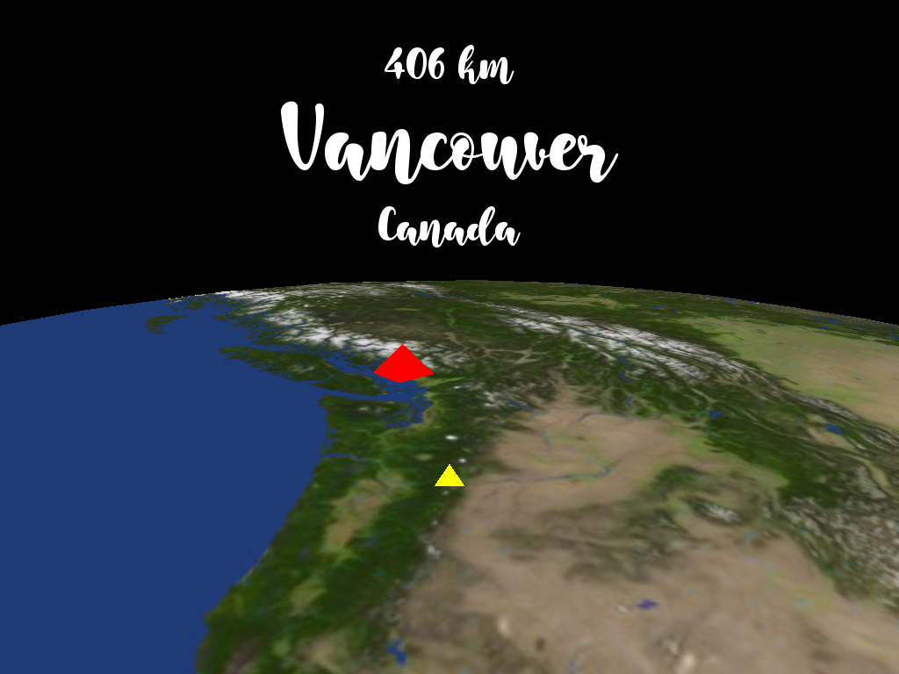

World Cities (SDL2 + OpenGL)
============================

Find cities by moving around the world with arrow keys.  
Press space bar to change the destination city.  
Press a, s, d to zoom in and out.

Language and Libraries
----------------------

- [C++17](https://isocpp.org/)
- [SDL2](https://www.libsdl.org/)
- [SDL_image](https://www.libsdl.org/projects/SDL_image/)
- [SDL_ttf](https://www.libsdl.org/projects/SDL_ttf/)
- [OpenGL 3.3](https://www.opengl.org/)
- [GLEW](https://github.com/nigels-com/glew)
- [SOIL](https://github.com/gameprogcpp/code/tree/master/External/SOIL)

Resources and References
------------------------

- [2020 Global Cities Index: New priorities for a new world - Kearney](https://www.kearney.com/global-cities/2020)
- City and country information on [GeoNames](http://www.geonames.org/)
- Earth day map (8k) on [Solar Textures | Solar System Scope](https://www.solarsystemscope.com/textures/)
- [Good Things Font | dafont.com](https://www.dafont.com/good-things.font)
- [Madhav, Game Programming in C++: Creating 3D Games | Pearson](https://www.pearson.com/us/higher-education/program/Madhav-Game-Programming-in-C-Creating-3-D-Games/PGM1102283.html)
